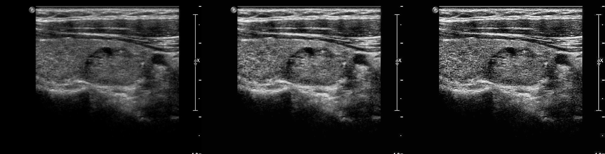
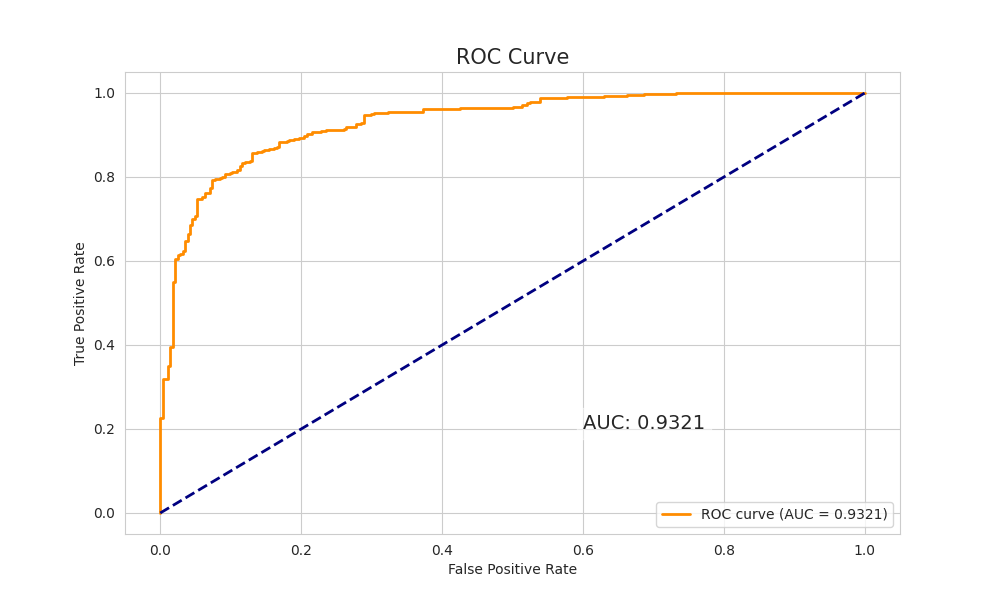
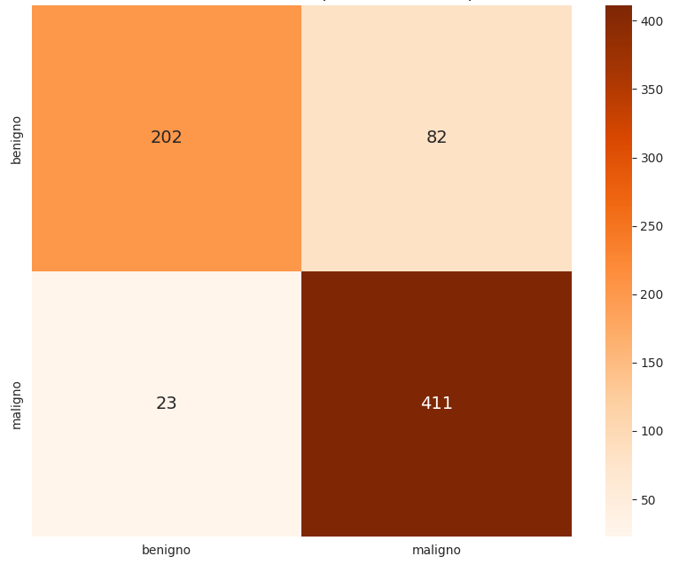

# Thyroid-Nodule-AI

### Ultrasound CAD Pipeline for Thyroid Nodule Detection and Classification

[](https://www.python.org/)
[](https://pytorch.org/)
[]

> **Research-grade Computer-Aided Diagnosis (CAD) pipeline** for thyroid ultrasound images.
> This repository accompanies a thesis project and implements a complete workflow including **nodule detection, ultrasound-specific preprocessing, classification, and explainability**, together with a lightweight GUI demo.
>
> ⚠️ **For research and educational use only. Not a certified medical device.**

---

## Table of contents

* [Status & scope](#status--scope)
* [Project overview](#project-overview)
* [Methodology & experimental design](#methodology--experimental-design)
* [Image preprocessing & ablation study](#image-preprocessing--ablation-study)
* [Results](#results)
* [Explainability & clinical interpretation](#explainability--clinical-interpretation)
* [Pipeline overview](#pipeline-overview)
* [Quickstart](#quickstart)
* [GUI demo](#gui-demo)
* [Pretrained weights & licensing](#pretrained-weights--licensing)
* [Datasets & data licensing](#datasets--data-licensing)
* [Reproducibility](#reproducibility)
* [Requirements](#requirements)
* [Repository contents](#repository-contents)
* [Citation](#citation)
* [License](#license)
* [Contact](#contact)

---

## Status & scope

This repository contains the **full experimental pipeline used in a thesis project** focused on thyroid nodule classification from ultrasound images.

* ✔️ Detection → classification → explainability
* ✔️ CNN vs Vision Transformer comparison
* ✔️ Ultrasound-specific preprocessing and ablation
* ✔️ Quantitative and qualitative evaluation
* ❌ No patient data included
* ❌ Not intended for clinical deployment

---

## Project overview

Thyroid ultrasound is a low-cost and non-invasive imaging modality, but it is affected by **high inter-observer variability**, **vendor-dependent appearance**, and **low contrast**.

This work proposes a **modular CAD pipeline** that:

* localizes thyroid nodules,
* applies ultrasound-specific preprocessing,
* classifies nodules as **benign vs malignant**,
* provides **visual explainability** to support clinical interpretation.

The project focuses on a **systematic comparison between CNN-based models and Vision Transformers**, evaluating whether self-supervised transformer backbones (DINOv3) can outperform classical CNNs in this domain.

---

## Methodology & experimental design

### Detection models evaluated

The detection stage was evaluated using multiple architectures:

* YOLOv12 (Nano / Small / Medium)
* DINO-DETR
* Faster R-CNN (ResNet-50 backbone)

The detector is used to localize candidate nodules and generate crops for the classification stage.

> ⚠️ YOLOv12 weights are **not included** due to AGPL-3.0 licensing constraints.

---

### Classification models evaluated

A broad comparison was performed between CNN-based and Vision Transformer-based classifiers:

**CNN-based models**

* EfficientNetV2
* ConvNeXtv2

**Vision Transformer models**

* DINOv3 (Small, Base, Large)

All classifiers were trained using the **same data splits, preprocessing pipeline, and evaluation protocol** to ensure a fair comparison.

---

## Image preprocessing & ablation study

Ultrasound images exhibit strong intensity variability across devices and acquisition settings.
Several preprocessing strategies were evaluated:

* **Contrast Limited Adaptive Histogram Equalization (CLAHE)**
* **Unsharp masking**
* **Adaptive crop padding**
* Standard resizing and normalization

An **ablation study** was conducted to measure the contribution of each preprocessing step to classification performance.



---

## Results

### Classification performance (test set)

| Model            | AUC      | Accuracy | Sensitivity | Specificity |
| ---------------- | -------- | -------- | ----------- | ----------- |
| EfficientNetV2   | 0.86     | 0.82     | 0.84        | 0.80        |
| ConvNeXtv2       | 0.88     | 0.85     | 0.87        | 0.83        |
| **DINOv3-Large** | **0.93** | **0.88** | **0.90**    | **0.86**    |

The **DINOv3-Large** model achieved the best overall performance and was selected as the final classification backbone.




---

## Explainability & clinical interpretation

To improve transparency and interpretability, **Grad-CAM and attention-based heatmaps** were generated for each prediction.

These visualizations highlight image regions contributing most to the model decision and allow qualitative comparison with **K TI-RADS criteria** used in clinical practice.


---

## Pipeline overview


1. **Detection** — candidate nodule localization
2. **Crop & enhancement** — ultrasound-specific preprocessing
3. **Classification** — benign vs malignant prediction
4. **Explainability** — Grad-CAM / attention maps
5. **Evaluation** — ROC, confusion matrix, metrics

---

## Quickstart

```bash
git clone https://github.com/AlexThunder01/Thyroid-Nodule-AI.git
cd Thyroid-Nodule-AI

python -m venv venv
source venv/bin/activate

pip install -r requirements.txt
pip install -r requirements-gui.txt
```


## GUI demo

```bash
python src/gui/app.py
```

The GUI allows drag-and-drop inference with visualization of detection, classification scores, and Grad-CAM heatmaps.


---

## Pretrained weights & licensing

### DINOv3 (included)

* Fine-tuned **DINOv3-Large** weights are provided via **Hugging Face**
* Original backbone released by **Meta AI**
* License: **Meta AI DINOv3 License**

See:
[https://ai.meta.com/resources/models-and-libraries/dinov3-downloads/](https://ai.meta.com/resources/models-and-libraries/dinov3-downloads/)

Weights are released for **research and educational use only**.

---

### YOLOv12 (not included)

* License: **GNU AGPL-3.0**
* Weights are **not distributed** to avoid AGPL contamination

See:
[https://roboflow.com/model-licenses/yolov12](https://roboflow.com/model-licenses/yolov12)

---

## Datasets & data licensing

* The **TN5000 thyroid ultrasound dataset** is **not included**
* Refer to the original publication for access and licensing details:

[https://www.nature.com/articles/s41597-025-05757-4](https://www.nature.com/articles/s41597-025-05757-4)

No patient data is redistributed in this repository.

---

## Reproducibility

To ensure reproducibility, the repository provides:

* Fixed random seed (`seed = 42`)
* Hardware details documented in the thesis (CUDA 12.2)

---

## Requirements

### Core

See `requirements.txt`

### GUI

See `requirements-gui.txt`

> On Linux systems, you may need:

```bash
sudo apt install python3-tk
```

---

## Repository contents

```
assets/        # figures, diagrams, demo images
configs/       # YAML experiment configs
docs/          # weights & reproducibility notes
examples/      # anonymized demo images
src/gui        # GUI
```

---

## Contributions

**Main contributions of this work:**

* A complete CAD pipeline for thyroid ultrasound imaging
* Systematic CNN vs Vision Transformer comparison
* Ultrasound-specific preprocessing ablation study
* Explainability aligned with clinical reasoning
* Interactive GUI for model exploration

---

## Citation

```bibtex
@misc{thyroid-nodule-ai-2025,
  author = {Alex Thunder},
  title  = {Thyroid Nodule AI: A Deep Learning Pipeline for Ultrasound CAD},
  year   = {2025},
  howpublished = {GitHub repository},
  note = {\url{https://github.com/AlexThunder01/Thyroid-Nodule-AI}}
}
```

---

## License

This repository **code** is released under the **MIT License**.
Model and dataset licenses are documented separately and must be respected.

---

## Contact

For questions, issues, or academic collaborations:
📧 **[catania.alex3@gmail.com](mailto:catania.alex3@gmail.com)**

---