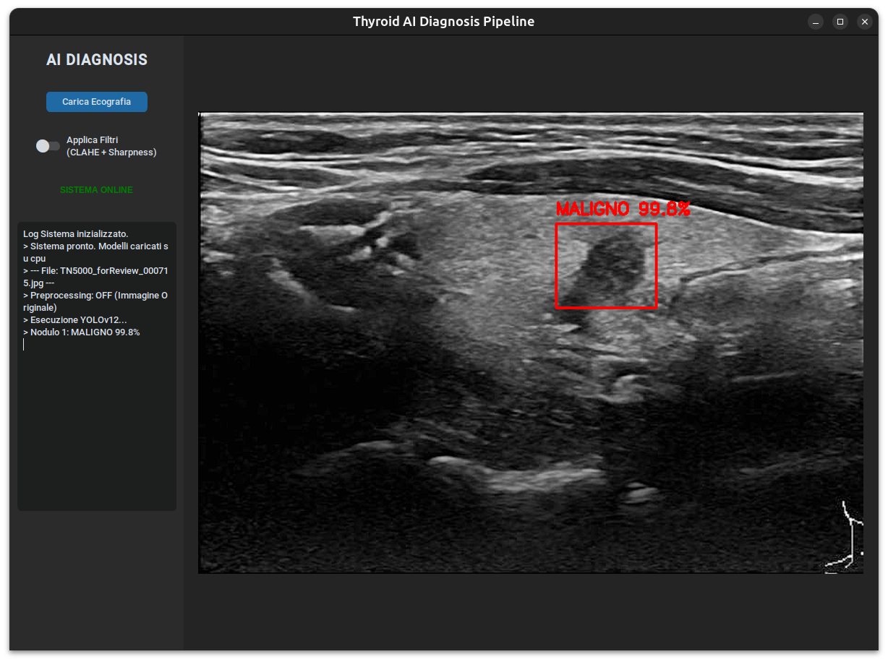
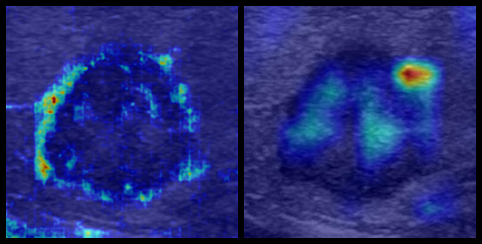
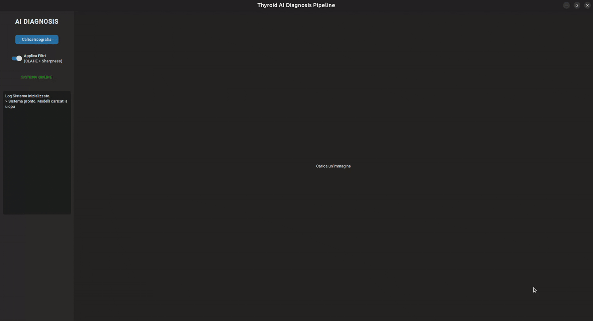

# 🩺 Thyroid Nodule AI: Deep Learning CAD Pipeline

[](https://www.python.org/)
[](https://pytorch.org/)
[](LICENSE)
[](Thesis.pdf)



> **Computer-Aided Diagnosis (CAD) system for Thyroid Ultrasound Analysis.**
>
> This repository contains the official implementation of the Bachelor's Thesis: *"Development of a Deep Learning pipeline for thyroid nodule diagnosis: Comparison between CNN and Vision Transformers"* (Sapienza University of Rome, 2025).

---

## 📖 Table of Contents
- [Project Overview](#-project-overview)
- [Methodology & Pipeline](#-methodology--pipeline)
- [Key Results](#-key-results)
- [Clinical Integration & Risk Stratification](#-Clinical-Integration--Risk-Stratification)
- [Installation](#-installation)
- [Usage (GUI & CLI)](#-usage-gui--cli)
- [Repository Structure](#-repository-structure)
- [Citation](#-citation)

---

## 🏥 Project Overview

Thyroid nodules are a pervasive clinical issue, present in up to 60% of the adult population. While the majority are benign, distinguishing the **5-10% of malignant cases** remains a challenge due to the subjective nature of ultrasound interpretation (high inter-observer variability).

This project proposes a **two-stage Deep Learning pipeline** to support radiologists:
1.  **Detection:** Localizing nodules in B-mode ultrasound images.
2.  **Classification:** Discriminating between Benign and Malignant nodules.
3.  **Explainability:** Visualizing the morphological features driving the AI's decision.

### Research Goal
The core study compares traditional **CNNs** (EfficientNet, ConvNeXt) against modern **Vision Transformers** (DINOv3, Swin) to determine if Self-Supervised Learning (SSL) offers superior robustness in processing noisy medical imagery.

---

## ⚙️ Methodology & Pipeline

The system processes raw ultrasound images through a strict pipeline described in **Chapter 3** of the thesis.

### 1. Preprocessing & Enhancement
Ultrasound images suffer from *speckle noise* and low contrast. Before inference, images undergo:
*   **Perceptual Hashing (dHash):** To remove duplicate frames and prevent data leakage.
*   **CLAHE:** Contrast Limited Adaptive Histogram Equalization.
*   **Sharpening:** To emphasize nodule margins (a critical TI-RADS feature).


*Figure: Effect of the enhancement pipeline. (Left) Original raw input. (Right) Enhanced image fed to the models.*

### 2. Architecture Comparison
We benchmarked the following architectures:

*   **Detection:** YOLOv12 (Anchor-Free) vs. DINO-DETR vs. Faster R-CNN.
*   **Classification:**
    *   **Baselines:** SVM (Radiomics), EfficientNetV2, ConvNeXt V2.
    *   **Our Approach:** **DINOv3 (ViT)** pretrained with Self-Supervised Learning (SSL).

---

## 📊 Key Results

The models were evaluated on the **TN5000** and **AUITD** datasets (7,000+ nodules).

### 🏆 Classification Performance (Test Set)

**DINOv3-Large** achieved state-of-the-art results, significantly outperforming CNNs in Sensitivity (Recall), which is the most critical metric for cancer screening.

| Architecture | Type | AUC-ROC | Recall (Sensitivity) | F1-Score |
| :--- | :---: | :---: | :---: | :---: |
| EfficientNetV2 | CNN | 0.898 | 92.63% | 0.864 |
| ConvNeXt V2 | CNN | 0.906 | 91.71% | 0.865 |
| **DINOv3-Large** | **ViT** | **0.932** | **94.70%** | **0.887** |

#### Visual Analysis
<p float="left">
  
  
</p>

*   **Left (ROC Curve):** The Foundation Model (Orange line) demonstrates superior separation capabilities ($AUC=0.93$).
*   **Right (Confusion Matrix):** High accuracy in identifying malignant cases, minimizing dangerous False Negatives.

---

## 🩺 Clinical Integration & Risk Stratification

The system is designed as a **Decision Support Tool**. While the model performs a binary classification (Benign vs. Malignant) using an optimized operational threshold ($p=0.38$), the raw probability score ($p$) provides a granular estimation of malignancy risk.

Validation on external datasets (Chapter 5.5.4) confirms that the model's confidence levels correlate strongly with the **K-TIRADS** risk categories, allowing for a professional interpretation of the AI output:

| AI Confidence ($p$) | Classification | Clinical Interpretation | Suggested Action |
| :--- | :--- | :--- | :--- |
| $p < 0.20$ | **Benign** | Low risk (Correlates to TR1/TR2) | Routine follow-up |
| $0.20 \le p < 0.60$ | **Indeterminate** | Moderate risk (Correlates to TR3/TR4) | Short-term follow-up / FNA |
| $p \ge 0.60$ | **Malignant** | **High Risk (Correlates to TR5)** | **Strong Biopsy Recommendation** |

### 🔍 Explainability (Heatmaps)
To move beyond "Black Box" AI, the pipeline integrates **Attention Maps** (for DINOv3) and **Grad-CAM** (for CNNs). This allows clinicians to verify if the AI is focusing on relevant radiological features, such as:
*   **Irregular Margins:** Precisely outlined by the Transformer's global attention.
*   **Microcalcifications:** Detected as high-frequency textures by the CNN backbones.


*Figure: DINOv3 attention maps focusing on the irregular borders of a malignant nodule, aligning with K-TIRADS criteria.*

---

## 💻 Installation

### Prerequisites
*   **OS:** Linux (Recommended) or Windows 10/11
*   **Python:** 3.10+
*   **Hardware:** NVIDIA GPU with CUDA support (Recommended for DINOv3)

### Setup Steps

```bash
# 1. Clone the repository
git clone https://github.com/YourUsername/Thyroid-Nodule-AI.git
cd Thyroid-Nodule-AI

# 2. Create a virtual environment
python -m venv venv
source venv/bin/activate  # On Windows: venv\Scripts\activate

# 3. Install core dependencies (PyTorch, Ultralytics, etc.)
pip install -r requirements.txt

# 4. (Optional) Install GUI dependencies
pip install -r requirements-gui.txt
```

> ⚠️ **Model Weights:** Due to file size limits and licensing, weights are not included in the repo. Please refer to [`docs/WEIGHTS.md`](docs/WEIGHTS.md) for download links and placement instructions.

---

## 🚀 Usage (GUI & CLI)

### 1. Thyroid AI Assistant (GUI)
A user-friendly interface for simulating the clinical workflow (Drag & Drop, Real-time Analysis).

```bash
python src/gui/app.py
```

**Features:**
*   Visual toggle for Preprocessing (CLAHE).
*   Real-time Detection (YOLO) and Classification (DINO).
*   PDF Report generation (Experimental).



### 2. Command Line Interface (CLI)
Run the classifier on a single image via terminal.

```bash
python3 src/inference_dino.py \
  --image path/to/your/image.jpg \
  --weights path/to/model_weights.pt \
  --dino-repo dinov3 \
  --out-dir results
```

**Arguments:**

| Argument | Description | Example |
| :--- | :--- | :--- |
| `--image` | Path to the input image (supports .jpg, .png). | `assets/benign.jpg` |
| `--weights` | Path to the trained DINOv3 `.pt` file. | `models/dinov3_large.pt` |
| `--dino-repo` | Path to the local DINOv3 repository/folder. | `dinov3` |
| `--out-dir` | Directory where the result will be saved. | `results` |

> **Note:** The script automatically applies the preprocessing pipeline (CLAHE + Sharpening) before inference.

---

## 📂 Repository Structure

```text
.
├── assets/                 # Images, plots, and demo resources
│   ├── benign              # Images of benign nodules
│   └── malignant           # Images of malignant nodules
├── dinov3/                 # Submodule for Vision Transformer architecture
├── docs/                   # Documentation
│   ├── GUI.md              # User manual for the interface
│   └── WEIGHTS.md          # Links to pretrained models
├── src/                    # Source code
│   ├── gui/                # Application logic (CustomTkinter)
│   └── inference_dino.py   # CLI inference script
├── Thesis.pdf              # Full Bachelor's Thesis document
├── CITATION.bib            # BibTeX citation
├── LICENSE                 # MIT License
├── MODEL_CARD.md           # Model specifics and limitations
├── requirements.txt        # Python dependencies
└── requirements-gui.txt    # gui dependencies
```

---

## 🎓 Citation

If you use this work in your research, please cite the thesis:

```bibtex
@bachelorsthesis{catania2025thyroid,
  author  = {Alessandro Catania},
  title   = {Development of a Deep Learning pipeline for thyroid nodule diagnosis: Comparison between CNN and Vision Transformers},
  school  = {Sapienza University of Rome},
  year    = {2025},
  type    = {Bachelor's Thesis}
}
```

---

### Acknowledgments
*   **Sapienza University of Rome** - Faculty of Information Engineering.
*   **Ultralytics** for the YOLOv12 framework.
*   **Meta AI** for the DINOv3 foundation model.

---
*For questions or collaborations, please open an Issue.*